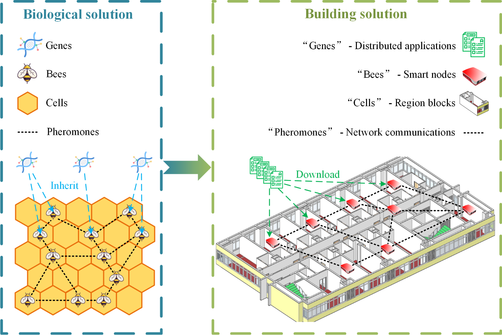
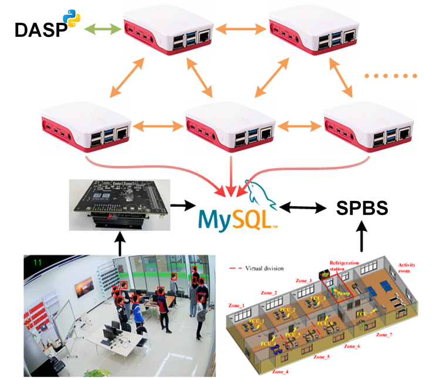

<!-- ABOUT DSBS -->

## About distributed smart building simulation (DSBS)

**DSBS** use semi-physical simulation to construct a Honeycomb prototype that has been deployed in a multi-zone office. It helps to closely approximate real building scenarios and facilitates the rapid deployment of Honeycomb in actual buildings.

DSBS consists of four main components: distributed application operating environment (DAOE), distributed algorithm simulation platform(DASP), semi-physical building simulator (SPBS) and occupancy measurement system (OMS). 

DAOE is deployed in smart nodes and serves as a runtime environment for distributed applications (DAPP). DASP is a simulation platform that allows testing and validating distributed algorithms using processes that simulate smart nodes on a single computer. SPBS is a semi-physical simulation of the Honeycomb prototype that approximates the actual system model and is used to simulate the experimental environment, execute control commands (given by the control algorithm on DAOE), and provide environmental responses. OMS uses video from a camera or a file to count the number of occupants and gives this information to the control algorithm on the DAOE.

**Reference:**

Xing, T., Yan, H., Sun, K., Wang, Y., Wang, X., and Zhao, Q. (2022). Honeycomb: An open-source distributed system for smart buildings. Patterns 3, 100605. [(Link)](https://doi.org/10.1016/j.patter.2022.100605)

Wang, Y., Zhao, Q., Yan, H., and Yang, W. (2022). DSP, a Plug-and-Play Process-Based Distributed Algorithm Simulation Platform. Scientific Programming 2022, e3886729. [(Link)](https://doi.org/10.1155/2022/3886729)

<!-- AUTHOR -->

## Author

Yan Hu yanh20@mails.tsinghua.edu.cn